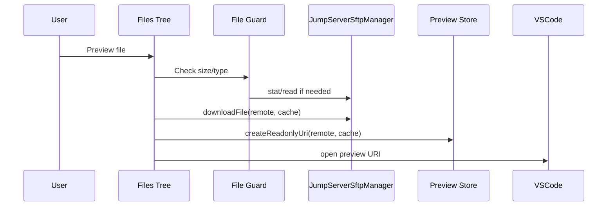
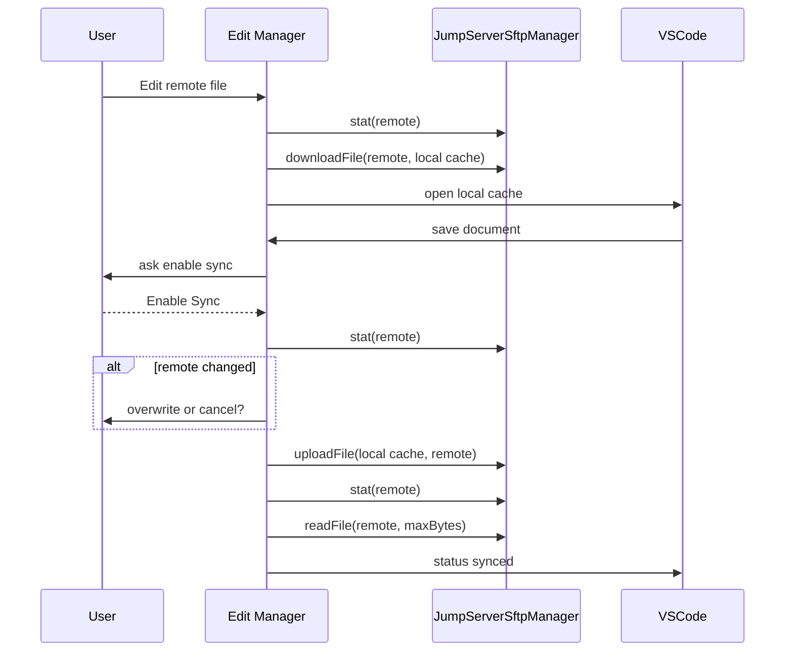

# JumpServer SFTP Phase Two Preview And Edit Design

## Goal

Add second-phase JumpServer SFTP file preview and edit support on top of the existing KoKo SFTP file manager.

Phase two scope:

- Right-click remote file `Preview` from the Files tree.
- Right-click remote file `Edit` from the Files tree.
- Download editable files into an extension-owned local cache.
- On first save in an edit session, ask whether to enable save-to-upload sync.
- After sync is enabled, upload subsequent saves automatically for that edit session.
- Before upload, detect remote changes and ask whether to overwrite or cancel.
- Verify upload success by remote stat and, when feasible, remote content comparison.
- Clean up preview and edit cache files when tabs/documents close.

User-confirmed behavior:

- First save asks for sync confirmation; later saves in the same edit session auto-upload.
- If the remote file changed after opening, ask `Overwrite Remote` or `Cancel Upload`.
- Provide both `Preview` and `Edit` context-menu entries.
- Default safety limit is 1 MB for preview/edit.
- Suspected binary files should not be previewed or edited; tell the user to use Download.

## Current Context

Phase one already provides:

- KoKo SFTP session creation through JumpServer connection tokens.
- File tree, upload/download, rename/delete/new folder/copy path, refresh, go up.
- Multi-terminal SFTP session tracking keyed by terminal id.
- Reserved manager/session interfaces:
  - `stat(path)`
  - `readFile(path, maxBytes)`
  - `writeFile(path, content)`
  - `createFile(path)`

Recent protocol findings that affect phase two:

- JumpServer KoKo SFTP is limited to the asset platform SFTP root. On the tested instance, `/` and `/tmp` resolve to the same managed area; `/home` and `/etc` do not expose the server filesystem.
- KoKo upload requires a numeric string message id and `offSet` in the payload. The current implementation has been adjusted for this.
- KoKo does not expose a separate direct `stat` command in the WebSocket SFTP API. The existing `stat` implementation derives stat from parent-directory `list`.
- `readFile` uses `download` with a max-byte guard.
- `writeFile` uses upload-to-same-path.

Reference implementation:

- `C:\Users\alan\Desktop\ssh-plugins\src\sftp\SftpPreview.ts`
- `C:\Users\alan\Desktop\ssh-plugins\src\sftp\SftpEditSessionManager.ts`
- `C:\Users\alan\Desktop\ssh-plugins\src\sftp\SftpNewFile.ts`

The JumpServer implementation should copy the interface shape and lifecycle ideas, not the native SSH/SFTP transport.

## User Experience

### Preview

Files tree context menu:

- `Preview`

Preview flow:

1. User right-clicks a remote file and selects `Preview`.
2. The extension checks the entry is a file.
3. The extension checks size, using tree entry size or `stat`.
4. If size is over 1 MB, show a warning and suggest `Download`.
5. The extension downloads the remote file into a preview cache.
6. It checks whether the content looks binary.
7. If text-like, it opens a read-only virtual document.
8. When the tab closes, the preview cache file is deleted.

Preview must never write back to the remote asset.

### Edit

Files tree context menu:

- `Edit`

Edit flow:

1. User right-clicks a remote file and selects `Edit`.
2. The extension checks the entry is a file.
3. The extension checks size, using tree entry size or `stat`.
4. If size is over 1 MB or content looks binary, show a warning and suggest `Download`.
5. The extension records the base remote stat.
6. The extension downloads the file into an edit cache path.
7. The file opens in VS Code as a normal local editable document.
8. On first save, prompt: enable automatic sync to this remote file?
9. If the user cancels, the save remains local and remote upload does not happen.
10. If the user enables sync, upload begins after a short debounce.
11. On later saves in the same edit session, upload starts automatically.
12. Before each upload, compare current remote stat to the base stat.
13. If the remote changed, ask whether to overwrite or cancel.
14. After upload, refresh base remote stat and verify size.
15. If remote content can be read within the size limit, compare content bytes too.

Edit sessions are scoped by active SFTP connection and remote path. Opening the same remote file again should focus the existing local cache file instead of creating a second session.

## Architecture

### Preview Store

Add `src/sftp/SftpPreview.ts`.

Responsibilities:

- Provide a read-only `TextDocumentContentProvider`.
- Generate safe preview document URIs.
- Download remote content to preview cache files.
- Return text content from cached files.
- Delete preview cache files when preview tabs close.

Proposed constants and APIs:

```ts
export const JUMPSERVER_SFTP_PREVIEW_SCHEME = 'jumpserver-sftp-preview';

export class SftpPreviewDocumentStore implements vscode.TextDocumentContentProvider {
  createReadonlyUri(remotePath: string, localPath: string): vscode.Uri;
  provideTextDocumentContent(uri: vscode.Uri): Promise<string>;
  deletePreviewFile(uri: vscode.Uri): Promise<void>;
  deletePreviewFilesForClosedTabs(tabs: readonly vscode.Tab[]): Promise<void>;
}

export async function openRemotePreviewFile(options: {
  storageUri: vscode.Uri;
  remotePath: string;
  previewStore: SftpPreviewDocumentStore;
  downloadFile(remotePath: string, localPath: string): Promise<void>;
  openUri(uri: vscode.Uri, options?: vscode.TextDocumentShowOptions): Promise<void>;
}): Promise<vscode.Uri>;
```

### Edit Session Manager

Add `src/sftp/SftpEditSessionManager.ts`.

Responsibilities:

- Create deterministic local cache paths.
- Track edit sessions by `connectionKey + remotePath` and local path.
- Open existing sessions when available.
- Listen for document save events.
- Confirm auto-sync on first save.
- Debounce and serialize uploads.
- Detect remote conflicts before upload.
- Verify upload success.
- Clean up caches on close.
- Surface sync state through a VS Code status bar item.

The manager should use the existing `JumpServerSftpManager` through a small client interface:

```ts
interface JumpServerSftpEditClient {
  getActiveConnectionKey(): string | undefined;
  stat(remotePath: string, connectionKey?: string): Promise<JumpServerSftpFileStat>;
  readFile(remotePath: string, maxBytes: number, connectionKey?: string): Promise<Buffer>;
  downloadFile(remotePath: string, localPath: string, isDir?: boolean, connectionKey?: string): Promise<void>;
  uploadFile(localPath: string, remotePath: string, connectionKey?: string): Promise<void>;
}
```

`connectionKey` should be the terminal id for terminal-bound SFTP sessions, or the asset id for manually opened file sessions.

### File Safety Guard

Add `src/sftp/SftpFileGuards.ts`.

Responsibilities:

- Enforce default preview/edit limit: 1 MB.
- Detect binary-like content after download.
- Return clear, user-facing reasons for refusal.

Proposed behavior:

- If `entry.size` is known and greater than 1 MB, block before download.
- If size is unknown, use `stat`.
- If stat is unavailable or inconclusive, download with `readFile(maxBytes + 1)` style guard and fail if exceeded.
- Binary detection should reject buffers containing NUL bytes or a high ratio of control characters in the first sample.

### Extension Wiring

Add commands:

- `jumpserverManager.sftp.preview`
- `jumpserverManager.sftp.edit`

Manifest:

- Add both commands to `contributes.commands`.
- Add context-menu entries for `view == jumpserverManager.sftpFiles && viewItem == jumpserverSftpFile`.
- Do not expose these actions for directories.

Activation:

- Instantiate `SftpPreviewDocumentStore`.
- Register content provider for `JUMPSERVER_SFTP_PREVIEW_SCHEME`.
- Instantiate `SftpEditSessionManager`.
- Add a status bar item for edit sync state.
- Register close listeners for preview cleanup.
- Add manager/status/store disposables to `context.subscriptions`.

## Data Flow

Preview:



Edit:



## Error Handling

Show clear messages for:

- No active JumpServer SFTP asset.
- Selected item is not a file.
- Remote file is larger than 1 MB.
- Remote file appears to be binary.
- Download failed.
- User did not enable sync on first save.
- Remote file changed before upload.
- Upload failed.
- Upload verification failed.
- Session expired or SFTP connection closed.

Do not expose passwords, bearer tokens, cookies, connection token ids, or local cache internals in user-facing errors.

## Cache And Cleanup

Preview cache:

- Store under `context.globalStorageUri` or a workspace-local extension cache.
- Delete when preview tab closes.
- Delete all active preview cache files on extension dispose.

Edit cache:

- Store under a deterministic path such as:
  - `<storage>/sftp-edit/<safe-connection-key>/<hash(remotePath)>/<safe-name>`
- Keep one local file per connection/path edit session.
- On clean close, flush pending upload first, unregister session, and delete cache.
- If sync fails or is pending at close, warn the user and keep the local copy when needed.

## Testing Strategy

Unit tests:

- Preview store creates safe read-only URIs and serves cached content.
- Preview cleanup removes cache files on tab close.
- File guard blocks files over 1 MB.
- File guard blocks binary-like content.
- Edit session manager opens an existing session instead of duplicating it.
- First save prompts for auto-sync.
- Confirmed save uploads.
- Repeated saves debounce and serialize upload.
- Conflict detection prompts overwrite/cancel.
- Cancelled conflict does not upload.
- Upload verification checks remote size and content.
- Closing an edit session flushes pending upload.
- Extension registers preview/edit commands and file context menu entries.

Manual tests:

- Open Preview for a small text file.
- Confirm Preview is read-only and does not upload on save attempts.
- Open Edit for a small text file.
- Save once, choose not to enable sync, confirm remote is unchanged.
- Save again or reopen, enable sync, confirm upload.
- Modify the same remote file externally, then save local edit and verify conflict prompt.
- Choose Cancel and verify remote is unchanged.
- Choose Overwrite and verify remote changes.
- Try a file over 1 MB and verify it suggests Download.
- Try a binary file and verify it suggests Download.
- Switch between two terminal-backed SFTP sessions and edit files in each.
- Close tabs and verify cache cleanup behavior.

## Non-Goals

- Editing directories.
- Editing files larger than 1 MB by default.
- Editing binary files.
- Cross-asset search.
- Native SSH/SFTP transport.
- Drag-and-drop recursive directory upload.
- MCP or agent tools.
- Changing JumpServer platform SFTP root from this extension.
- Bypassing JumpServer KoKo SFTP root restrictions.

## Acceptance Criteria

- Files tree has `Preview` and `Edit` for files only.
- Preview opens a small text file read-only.
- Edit opens a small text file in a local cache.
- First save asks whether to enable automatic sync.
- Once enabled, subsequent saves upload automatically in the same edit session.
- Remote stat changes trigger overwrite/cancel conflict handling.
- Upload success is verified by stat and content when feasible.
- Files over 1 MB and binary-like files are blocked with clear guidance to use Download.
- Existing phase-one file management still works.
- Existing SSH/MySQL terminal behavior still works.
- Unit tests and full project verification pass.
